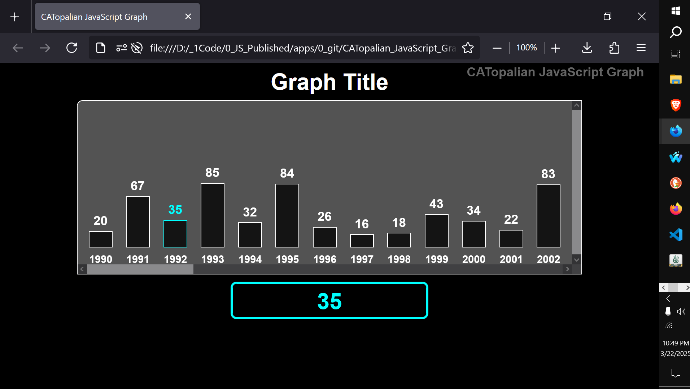

# CATopalian JavaScript Graph
A JavaScript application that generates a graph based on array data.  

USE APP: https://christopherandrewtopalian.github.io/CATopalian_JavaScript_Graph/CATopalian_JavaScript_Graph.html

  

---

### How to Download this App
1. Click the green Code Button on this github page
2. Choose Download ZIP
3. Save the Zip File
4. Extract All
5. Double click the HTML file to start the App

---

Happy Scripting :-)

